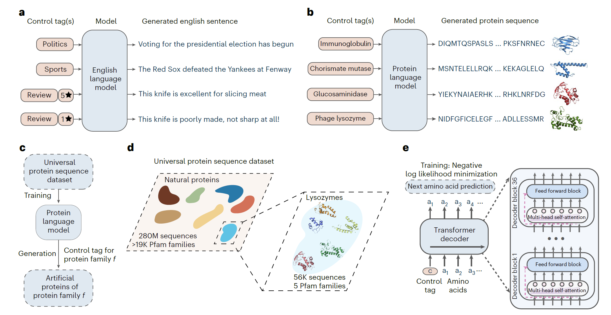
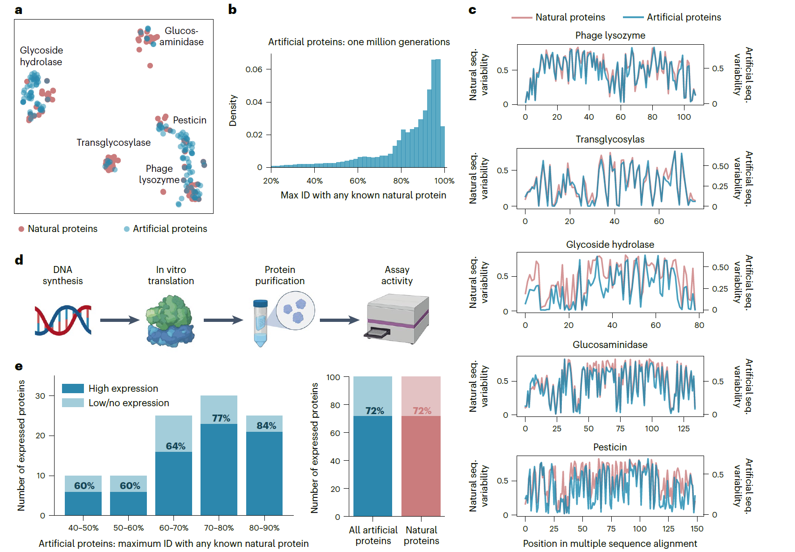
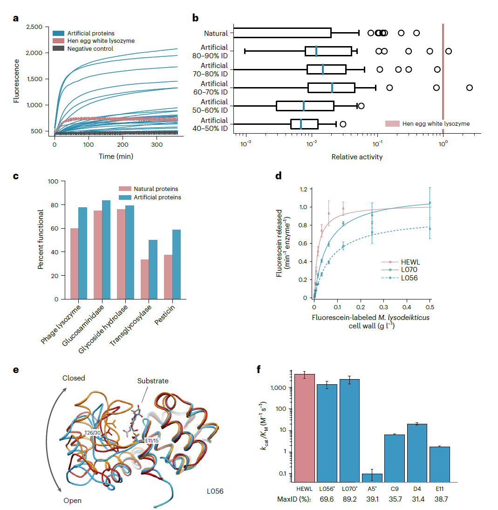
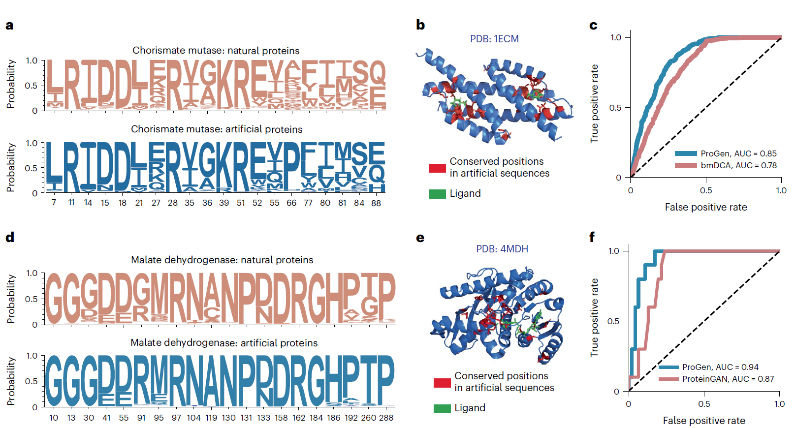
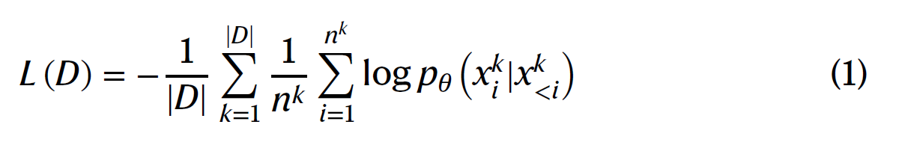
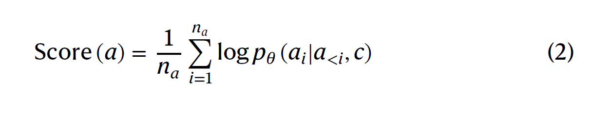
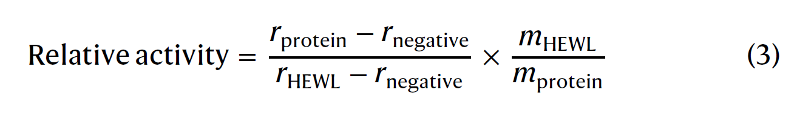
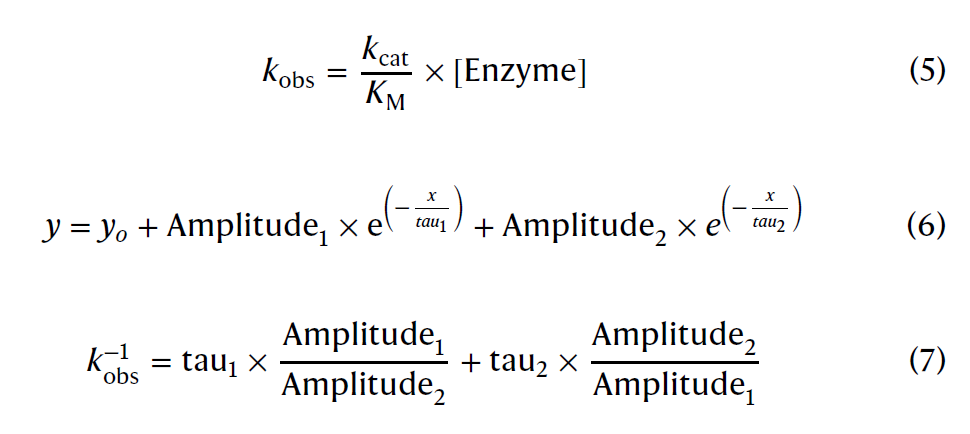

# The Paper  
## Introductio
传统的蛋白质工程方法通过对自然蛋白质序列进行迭代突变和选择，以识别具有期望的功能和结构特性的蛋白质。相比之下，理性或从零开始的蛋白质设计方法旨在提高创造具有期望特性的新蛋白质的效率和精确度。基于结构的从零开始设计方法利用基于生物物理原理的模拟，而共演化方法则从进化序列数据构建统计模型，以指定具有期望功能或稳定性的新序列。结构方法和共演化方法都有其局限性。结构方法依赖于稀缺的实验结构数据和难以处理或无法处理的生物物理模拟。共演化统计模型定制于特定的蛋白质家族，经常依赖于多序列比对，并且在定义的多序列比对之外的空间操作不佳。最近，深度神经网络作为蛋白质科学和工程的生成模型和判别模型显示出了前景。它们学习复杂表示的能力对于有效利用呈指数级增长的多样化且相对未注释的蛋白质数据源至关重要——包含数以百万计原始未比对蛋白质序列的公共数据库。  

受到基于深度学习的自然语言模型成功的启发，这些模型经过大量文本语料的训练，能够生成涵盖多种主题和情感的逼真文本，我们开发了ProGen，这是一个基于数百万条原始蛋白质序列训练的蛋白质语言模型，它能够生成跨多个家族和功能的人造蛋白质。虽然之前的工作已经表明，受自然语言启发的蛋白质统计表示对于蛋白质信息学任务（如稳定性预测、远源同源性检测和二级结构预测）是有用的，我们展示了如何采用基于深度学习的最新语言建模进展，从头开始生成功能与自然蛋白质一样好的人造蛋白质序列。  

ProGen通过迭代优化来学习预测在一条原始序列中，给定前面的氨基酸后下一个氨基酸的概率，而不需要显式的结构信息或成对的共演化假设。通过这种无监督方式从一个大型、多样化的蛋白质序列数据库（补充表1）训练，ProGen学习了一个通用的、领域独立的蛋白质表示，这种表示包含了局部和全局结构模式，类似于自然语言模型学习语义和语法规则。训练完成后，ProGen可以被提示从头开始为任何蛋白质家族生成全长蛋白质序列，这些序列与自然蛋白质有不同程度的相似性。在常见情况下，如果某个蛋白质家族的一些序列数据是可用的，我们可以使用预训练语言模型的微调技术，用家族特定的序列来进一步提高ProGen捕获与蛋白质家族对应的局部序列邻域分布的能力。  

ProGen是一个拥有12亿参数的神经网络，使用一个公开可用的包含2.8亿蛋白质序列的数据集进行训练。ProGen的一个关键组成部分是条件生成，即，通过控制标签（例如，蛋白质家族：Pfam ID PF16754, Pesticin）控制序列生成，这些标签作为输入提供给语言模型。在自然语言的情况下，这些控制标签可能是风格、主题、日期和其他实体。对于蛋白质而言，控制标签是蛋白质家族、生物过程和分子功能等属性，这些属性在公共蛋白质数据库的大量序列中是可用的。

    

图1 | 利用条件语言建模的人造蛋白质生成。a，条件语言模型是可以生成语义上和语法上正确的、新颖且多样化的自然语言文本的深度神经网络，通过输入控制标签来驾驭文本的风格、主题和其他实体。b，c，类似于自然语言模型，我们开发了ProGen，一个条件蛋白质语言模型（b），它根据输入控制标签（c）生成跨蛋白质家族的多样化人造蛋白质序列。d，ProGen使用一个大型的、普遍的蛋白质序列数据集进行训练，该数据集包含来自数千个家族的2.8亿个自然进化的蛋白质，其中五个多样化的溶菌酶家族在本研究中被实验性地表征。e，ProGen是一个基于变压器架构的12亿参数神经网络，该架构使用自注意力机制来建模全面的残基间相互作用。ProGen通过在普遍蛋白质序列数据集上最小化下一个氨基酸预测问题的损失来训练生成人造序列。 

## Results
我们通过在五个不同的溶菌酶家族的蛋白质上测试其生成物，实验性地评估了ProGen生成功能性人造氨基酸序列的能力（补充表2）。这些蛋白质家族包含大量的序列多样性（补充表3），平均序列长度在各个家族之间变化，从84到167不等。这些序列还显示出大的结构多样性和多种结构折叠（补充图2）。作为一个整体，对于一个在生成时不受限于已知功能野生型附近的局部序列邻域，并且也没有提供结构先验的模型来说，这代表了一个挑战性的设计空间。我们从Pfam和UniprotKB源收集了这五个家族的55,948个序列，以获得积极的对照，并用于微调ProGen。  

使用精选的溶菌酶数据集对ProGen进行微调后，我们通过为每个家族提供Pfam ID作为控制标签，使用ProGen生成了一百万条人造序列。我们的人造溶菌酶跨越了自然溶菌酶的序列景观（图2a），涵盖了包含多种蛋白质折叠、活性位点架构和酶促机制的五个家族。由于我们的模型可以在毫秒内生成全长人造序列，因此可以创建一个大型数据库，以扩展超越自然库的合理序列多样性（补充表3）。尽管从序列身份计算的角度看，人造序列可能与自然序列有所偏离（图2b和补充图3），但在形成每个家族内的自然和人造蛋白质的单独多序列比对时，它们显示出类似的残基位置熵。这表明模型捕获了进化保守模式，而无需训练显式的比对信息，如使用波特模型，正如在直接耦合分析中实现的那样。 

  

图2 | 生成的人造抗菌蛋白质多样且在我们的实验系统中表达良好。a，在使用t分布随机邻域嵌入（t-SNE）作为降维技术进行可视化分析时，我们模型的人造序列被展示为跨越了五个溶菌酶家族自然蛋白质的景观。每个点代表一个在二维t-SNE空间中嵌入的自然或生成序列。b，通过足够的采样，ProGen能生成与自然蛋白质高度不同的序列。最大ID测量人造蛋白质与任何公开可用的自然蛋白质的最大相似度。c，人造蛋白质保持了与自然蛋白质在家族间相似的进化保守模式。图展示了一库蛋白质中每个对齐位置的可变性。保守位置表现为曲线低谷。seq.，序列。d，从我们生成的蛋白质中，我们选择一百个蛋白质进行合成和在我们的实验设置中的表征。e，即使与自然的不同性增加（40-50%最大ID），人造蛋白质也表达良好，并且产生的表达质量与一百个代表性自然蛋白质相当。  

为了实验性地评估ProGen在从自然蛋白质序列发散的范围内的表现，我们基于生成质量和与自然序列的多样性选择了一百个序列，通过衡量与我们训练数据集中的任何蛋白质的最高命中身份（“最大ID”）来测量，该数据集包含2.8亿蛋白质，主要由UniParc21组成（补充图4）。我们选择的蛋白质包括100个人造序列（补充表2），每个蛋白质家族至少有8个蛋白质。人造蛋白质的平均序列长度在各个家族之间变化，从93到179不等，与我们从Pfam精选数据集中的自然溶菌酶可比。人造蛋白质包括在溶菌酶家族特定比对中从未在对齐位置观察到的特定氨基酸和成对相互作用（补充表4和5）。我们还从55,948个精选的溶菌酶序列中选择了一个正面对照组。我们使用MMseqs2对自然序列进行了聚类，并从五个家族中的每一个家族大约选择了20个聚类代表性序列。  

为了评估功能，我们通过无细胞蛋白质合成和亲和层析法合成并纯化了全长基因。在100种天然蛋白质的正向对照组中，有72%的蛋白质通过层析峰和条带可视化方法被良好地表达。ProGen生成的蛋白质同样良好地表达（总共100个中有72个），跨越所有与任何已知天然蛋白质的序列同一性区间（最大同一性40–90%；图2e）。此外，我们使用bmDCA7设计了人工蛋白质，这是一个基于直接耦合分析的统计模型，它明确近似了一阶和二阶残基依赖性。从他们公开可用的代码开始，我们试图使bmDCA模型与ProGen收敛到相同的序列，并使用额外的比对信息，在广泛的超参数范围内进行搜索。bmDCA无法拟合五个溶菌酶家族中的三个，并且在剩余的两个蛋白质家族中展示了60%的可检测表达（50个蛋白质中的30个）。这些结果表明，与一批天然蛋白质相比，ProGen可以生成结构良好、适于正确表达的人工蛋白质，即使序列比对的大小和质量限制了替代方法的成功。  

接下来，我们基于荧光素标记的微球菌溶解素细胞壁（分子探针EnzChek溶菌酶试剂盒）的猝灭释放来检查活性，从每组表达的100个蛋白质中随机选择了90个蛋白质。蛋白质在96孔板格式中准备，以提取随时间变化的荧光曲线（图3a）。天然进化的典范蛋白质，鸡蛋清溶菌酶（HEWL），作为阳性对照测量，此外还有泛素作为阴性对照。生成荧光高于任何阴性对照最大荧光一个标准偏差的蛋白质被认为是功能性的。在我们的人工蛋白质中，73%（66/90）是功能性的，并在各个家族中表现出高水平的功能性（图3c）。代表性的天然蛋白质表现出类似的功能水平，59%（53/90）的总蛋白质被认为是功能性的。所有的bmDCA人工蛋白质都没有表现出可检测的功能水平（补充图5），这可能是由于收敛、抽样或其他特定模型运行问题，进一步突出了ProGen提供的可能更为稳健的替代方案的多功能性。这些结果表明，ProGen生成的蛋白质序列不仅能够良好表达，而且还能在蛋白质家族的不同序列景观中保持酶功能。  

  

图3 | 人工蛋白质序列在达到低至31%的同一性到任何已知蛋白质时仍具有功能性，展示了与高度进化的天然蛋白质相当的催化效率，并展现了与已知天然折叠相似的结构。a，人工蛋白质能够很好地结合底物并随时间展示高荧光响应（n = 90）。对于HEWL和阴性（泛素）对照，展示了n = 3重复实验的最小和最大荧光范围作为条形图。b，即使与已知天然蛋白质不相似（40-50%最大同一性，即，顶部命中同一性），人工蛋白质仍保持活性。异常值表示高活性样本，其中相对活性是相对于HEWL计算的。箱形图基于每个类别从上到下分别的n = 90, 23, 28, 22, 8, 9个样本得出。箱形图显示中位数、第一四分位数和第三四分位数，须线延伸到1.5倍四分位距。c，人工蛋白质在蛋白质家族中具有功能性。功能性定义为荧光比所有阴性对照的最大值高出一个标准差。d，HEWL天然溶菌酶（红色）和两种生成的溶菌酶（蓝色；L056和L070）针对细胞壁底物的Michaelis-Menten动力学展示了可比的性能（n = 3个技术重复，误差条表示标准偏差）。e，我们确定了L056人工溶菌酶的2.5埃分辨率晶体结构。以天空蓝色呈现的L056晶体结构与两种代表性的T4溶菌酶构象的全局叠加图，‘开放’构象的M6I T4溶菌酶（PDB访问号150L）以深红色显示，‘闭合’构象的野生型T4溶菌酶（PDB访问号3FA0）以橙色显示，以及按元素着色的底物（PDB访问号148L）。催化苏氨酸（L056中的T30和T4溶菌酶中的T26）和第一个催化谷氨酸（L056中的E15和T4溶菌酶中的E11）以棒状表示。f，条形图代表了派生自溶菌酶变体的Michaelis-Menten kcat/KM常数，展示了对于最大序列同一性到已知天然蛋白质不同的变体之间的一系列催化活性。误差条代表由拟合过程得出的传播标准偏差（A5、L056和L070技术重复n = 3；C9和E11技术重复n = 4；每个n = 4技术重复的两个生物重复对于D4）。星号表示从初始速率分析派生的kcat/KM，并转换了单位（补充表7）。  

除了功能性的二进制值，我们还计算了相对于HEWL的体外测定的相对活性得分。我们的人工蛋白质即使在与任何已知天然蛋白质的序列同一性较低的情况下，也能匹配天然蛋白质的活性水平（图3b和补充图6）。值得注意的是，一小部分蛋白质，无论是天然蛋白质还是人工蛋白质，都在HEWL的一个数量级内，HEWL的活性显著高于所有阴性对照。这些高度活跃的异常值展示了我们的模型生成可能与经过进化压力高度优化的天然蛋白质竞争的序列的潜力。    

从100个人工蛋白质中，我们选择了五种蛋白质，它们覆盖了一个宽范围的最大同一性（48–89%）以在大肠杆菌中重组表达。其中，只有一个L008没有产生可检测的表达（补充图7）。两个（L013和L038）表达稳健到包涵体中，没有进一步追求。两种蛋白质，L056（最大ID 69.6%）和L070（最大ID 89.2%）表达良好，并对在16°C过夜诱导期间使用的大肠杆菌BL21（DE3）菌株产生了细菌杀伤活性。花费的培养基拥有酶活性，因此，酶从这种材料中纯化出来。    

虽然两种酶都以预期的大小作为单体通过体积排除色谱法纯化，但我们还观察到每种酶的一个定义的后洗脱（表观较低分子量，可能由于与色谱柱的葡聚糖组分结合）物种，通过SDS-PAGE对应于全长酶（补充图7）。两种单体的KM值过弱，无法使用异质的、荧光素标记的M. lysodeikticus细胞壁底物（分子探针EnzChek溶菌酶试剂盒）来测量；然而，两种单体使用假一级动力学测定法都是活跃的（补充图8）。相比之下，我们可以轻松测量纯化的表观较低分子量物种的KM值，其中L056和L070都非常活跃，并且与HEWL的Michaelis-Menten参数相当（图3d）。总的来说，L056和L070具有与HEWL可比的强大催化活性和杀菌能力，同时它们与最近已知的天然序列分别相差53和18个氨基酸。我们还发现，使L056和L070与它们各自最近的天然序列同源体发生差异的突变在位置或结构元素上没有偏见。不同的残基反而是均匀分布的。一些突变甚至发现在活性位点裂隙内以及影响构象状态的区域内（对于L056）。尽管具有可比的酶活性，L070和L056的序列同一性仅共享17.9%。总之，这些结果证明ProGen可以生成具有近乎天然活性的人工蛋白质。  

接下来，我们检查了人工蛋白质的结构分歧。我们确定了L056的2.5Å分辨率晶体结构（图3e和补充表6）。全局折叠与预测类似，与trRosetta预测的主链结构的Cα均方根偏差（RMSD）为2.9Å，与野生型T4溶菌酶结构的2.3Å RMSD。最大的结构分歧发生在由18-31残基形成的beta发夹。这个区域形成了底物结合裂缝的底部，并且是重要的底物结合运动的一部分。T4溶菌酶的M6I突变体的结构（蛋白质数据银行（PDB）访问号150L）被用作这个铰链“开放”状态的模型，并且更接近L056的结构（1.0Å Cα RMSD）。与一个共价困住底物的结构对齐（PDB访问号148L）揭示，活性位点裂缝形成良好，关键的催化残基Glu15（在T4L中为Glu 11）和关键的底物结合残基Thr30（在T4L中为Thr26）位置正确。此外，L056的疏水核心包装良好，只有两个小于5ų体积的小包装空隙，这对于此大小的结构是典型的。  

为了检查ProGen是否能在序列同一性的“暮光区”生成功能性蛋白质，其中两种蛋白质不被假设具有功能相似性，我们生成了95种新的人工序列，其最大序列同一性低于40%，对两个溶菌酶家族（PF00959和PF05838）。在选定的序列中，78/89（88%）表达良好，78中的24（31%）是可溶的（补充图9）。我们纯化了六种高表达的蛋白质，并发现它们都是活跃的，但与HEWL或之前生成的人工蛋白质L056和L070相比，Michaelis-Menten活性较低（图3f，补充图10和补充表7）。与天然蛋白质序列同一性最低的蛋白质D4（对一个Arcobacter nitrofigilis生物的蛋白质有31.4%的ID），其kcat/KM为20.2 M−1s−1，约为HEWL的200倍以下。虽然这些远程蛋白的活性显著较低，但可以采用定向进化来提高活性。总的来说，这些结果展示了一种生成足够远离序列空间、可能不被认为是传统序列同源体的可溶、活跃蛋白质的程序。  

为了进一步比较结构表示，我们使用AlphaFold2来预测功能性人工序列的结构。如L056的晶体结构，预测的人工结构大致匹配自然界中发现的已知结构（补充图11），包括低同一性（<40%）的人工序列。  

训练于跨越多个家族的普遍蛋白质序列数据集的ProGen，当提供相应的控制标签作为输入时，能够为任何家族设计蛋白质。为了探索这一能力超越溶菌酶家族，我们评估了ProGen在生成和预测先前其他方法已应用家族的功能性全长序列方面的性能：异戊二烯酸变构酶（CM）和苹果酸脱氢酶（MDH）。生成的蛋白质展示了与天然序列库类似的保守模式（图4a,d）。在将生成物与已知结构的序列对齐后（图4b,e），我们观察到生成序列中的保守位置与配体结合和埋藏残基相关。使用先前发表的序列及其对CM和MDH蛋白的实验测定数据，我们还评估了ProGen模型可能性与这些序列的相对活性的一致性，并将其与原始研究中使用的生成方法——bmDCA和proteinGAN进行了比较。具体来说，我们测量了使用ProGen的人工序列的每个令牌对数可能性，并使用它们来预测人工序列是否应该功能。在CM功能数据上，ProGen的对数可能性曲线下面积（AUC）为0.85，显著优于bmDCA的0.78（图4c）（P < 0.0001，双尾测试，n = 1617）。在MDH功能数据上，ProGen的对数可能性AUC为0.94（图4f），优于ProteinGAN鉴别器分数的AUC 0.87（P < 0.1，双尾测试，n = 56）。总的来说，ProGen的模型可能性与两个不同蛋白质数据集——CM和MDH——的实验测定数据更为一致，优于原始研究中特别为这些家族定制的序列生成方法。

  

图4 | 条件语言建模在其他蛋白质系统的适用性。a,b，使用适当的控制标签，我们的语言模型ProGen可以为不同的蛋白质家族生成序列。这里我们展示ProGen可以生成CM酶，这些酶展示了与自然界相似的残基分布（a）以及生成序列中的保守残基与配体结合位点相关（b）。c，ProGen的模型可能性也可以准确预测已发布数据中CM变体的功能性，略优于原始研究中的共进化bmDCA7算法。d，ProGen也可以生成展示了与自然界相似残基分布的MDH蛋白。e，生成序列中的保守残基与埋藏残基相关。f，ProGen的模型可能性在预测已发布的MDH变体的功能性方面也是准确的，与原始研究中使用的生成性proteinGAN55模型相似。  

为了理解普遍序列数据集和感兴趣的蛋白质家族序列对ProGen生成能力的相对影响，我们使用CM和MDH的实验测定数据进行了两项削减研究。首先，我们评估了仅用普遍序列数据集训练的ProGen的性能。我们为这个版本的ProGen测量了使用CM和MDH控制标签的人工序列的每个令牌对数可能性。这些可能性显示，与经过微调的ProGen相比，预测人工序列是否应该功能时，AUC显著下降了CM的0.18（P < 0.0001，双尾测试，n = 1,617）和MDH的0.08（P < 0.1，双尾测试，n = 56）。相反，仅在CM和MDH蛋白质序列上训练的ProGen架构，没有普遍序列数据集的初始训练的好处，与经过微调的ProGen相比，性能也显著下降——AUC分别下降了0.11（P < 0.0001，双尾测试，n = 1,617）和0.04（P < 0.05，双尾测试，n = 56）。这些结果表明，我们的训练策略的两个组成部分——普遍序列数据集的初始训练和对感兴趣的蛋白质家族的微调——对最终模型性能有重大贡献。使用包含许多蛋白质家族的普遍序列数据集进行训练，使ProGen能够学习一种通用的和可转移的序列表示，编码了内在的生物属性。对感兴趣的蛋白质家族的微调引导了这种表示，以提高局部序列邻域的生成质量。类似于在自然语言处理和计算机视觉中，使用大数据集训练的神经网络通过转移学习和微调所显示的适应性，蛋白质语言模型有潜力成为生成具有所需属性的定制蛋白质的多功能工具。在补充图12中，不同蛋白质家族的可用序列分布表明，我们当前的技术在蛋白质宇宙的很大一部分中将是有用的。我们推测，可能有可能成功生成具有功能活性的人工蛋白质，特别是对于较大的蛋白质家族，尽管可能会以较小的成功率这样做。在我们的研究中，我们没有尝试在没有额外微调的情况下实验测试生成的序列。 

## Discussion
总之，我们的研究显示，一个仅使用进化序列数据训练的最新的基于变压器的条件语言模型能够跨蛋白质家族生成功能性人工蛋白质。额外的分析表明，我们的模型已经学习了一种灵活的蛋白质序列表示，可以应用于多样的家族，如溶菌酶、CM和MDH。虽然我们不期望我们的语言模型生成属于完全不同分布或领域的蛋白质（例如，创造一个催化非自然反应的新折叠），但它可以大幅扩展由进化抽样的蛋白质序列空间。结合生物物理建模与生成模型可能进一步帮助我们探索与进化抽样完全不同的数据分布。我们模型的应用可能包括生成合成的高度可能功能性蛋白质库，用于发现或迭代优化。结合不断增加的序列数据来源和更具表现力的控制标签，我们的工作指出了使用基于深度学习的语言模型进行精确从头设计蛋白质以解决生物学、医学和环境问题的潜力。  

## 在线内容
任何方法、额外参考资料、《自然》投稿系列报告摘要、源数据、扩展数据、补充信息、致谢、同行评审信息；作者贡献细节和竞争利益声明；以及数据和代码可用性声明都可以在https://doi.org/10.1038/s41587-022-01618-2处获得。 

## Methods
训练数据策划
为了训练ProGen，我们收集了一个包含281百万个非冗余蛋白质序列（来自超过19,000个Pfam家族）及相关元数据（作为控制标签）的普遍蛋白质序列数据集，这些数据来自UniParc、UniprotKB、Pfam和NCBI的分类信息（图1d及补充表1）。氨基酸词汇包括标准的25种氨基酸指定符，按照IUPAC规范。控制标签分为两类：（1）关键词标签和（2）分类学标签。遵循UniprotKB控制的、层级化的关键词词汇定义（许多词汇来源于基因本体（GO）术语），控制关键词标签包括从细胞组成、生物过程和分子功能术语中选出的1,100个术语。分类学标签包括来自NCBI分类在八个标准分类等级中的100,000个术语。聚合数据集被划分为一个训练集，大小为2.8亿，和两个测试集，一个是来自20个蛋白质家族、大小为10万的分布外测试集（OOD-test）和一个随机抽样的领域内测试集（ID-test），大小为100万，这些都是在训练中保留并用于评估的。在训练数据库上训练模型之后，模型进一步训练，即对以下数据集进行微调，用于生成和分类任务。  

对于溶菌酶蛋白质的微调，从Pfam数据库中选出了五个蛋白质家族，即噬菌体溶菌酶（PF00959）、杀虫素（PF16754）、氨基葡萄糖酰胺酶（PF01832）、糖苷水解酶家族108（PF05838）和跨糖基酶（PF06737），共计55,948个序列。在微调过程中，蛋白质以未对齐的蛋白质序列形式提供给模型，并在蛋白质家族指定的控制标签前加上一个。对CM蛋白质的微调，使用HHBlits和blastp对EcCM（大肠杆菌CM-前苯丙氨酸脱水酶的CM域，即P蛋白）的1-95残基进行搜索，共获得20,214个序列。对MDH蛋白质的微调，选择了Interpro IPR001557中的L-乳酸/MDH蛋白质家族，共有17,094个序列。  

### 条件语言建模
设a = (a1, ..., ana)是一个指定蛋白质的氨基酸序列，长度为na - 1，并附加了一个“序列结束”标记。设c = (c1, ..., cnc)是一组与之相关的描述符，比如蛋白质家族或来源生物，即“控制标签”，通过这些我们希望控制氨基酸序列的生成。设x = [c;a]是通过在氨基酸序列前加上控制标签序列形成的序列。这样一个组合序列的长度n = na + nc的概率则为P(x)。语言建模将生成x的问题分解为下一个令牌预测问题，其中令牌可以是氨基酸或控制标签。我们训练一个带参数θ的神经网络，以最小化数据集D = {x1, … , x|D|}上的负对数似然。  

                        
通过顺序采样其组成令牌：pθ(a1|c), pθ(a2|a1, c),…,pθ(aj|a<j, c)（参考文献65），然后可以生成一个长度为ma、由长度为mc的控制标签序列编码的所需属性的新蛋白质a。生成持续进行，直到模型生成一个“序列结束”令牌。  

我们使用基于变压器的神经网络架构来构建ProGen。变压器通过一系列堆叠的层来学习序列内的长距离上下文，每个层都包含一个自注意力机制（图1e）。每层中的自注意力机制推断其输入序列中所有位置之间的成对交互关系。堆叠多个自注意力层允许我们学习多残基相互作用。基于变压器的方法已被证明与序列设计的共进化方法相关，如马尔科夫随机场（MRFs）、Potts模型和霍普菲尔德网络。 

与编码氨基酸序列用于歧视性蛋白质预测任务的基于变压器的语言模型不同，ProGen是一个为自回归生成量身定制的解码器变压器：它以从左到右的方式、逐令牌生成序列，下一个令牌取决于所有之前生成的令牌。  

ProGen的变压器架构有36层，每层8个自注意力头，共有12亿可训练的神经网络参数。我们训练ProGen以最小化使用此数据集的负对数似然，批量大小为2048，进行了100万次迭代。训练在256个Google Cloud TPU v3核心上进行了2周。一旦训练完成，ProGen就可以通过指定控制标签（例如，来自Pfam的蛋白质家族标识符；图1c）从头开始生成蛋白质序列。  

### ProGen训练
在训练过程中，我们包括了每个序列及其反向序列。我们在每个序列前加上相应的控制标签子集。对于给定的序列，在不同的数据库中可能有多个版本，每个版本都有其关联的控制标签。我们随机抽样选择使用哪组控制标签，但倾向于抽样SwissProt标签，因为它们是手工验证的。此外，我们总是包括一个仅有序列而没有控制标签的样本，以便ProGen可以仅使用序列数据来完成蛋白质的补全。我们将所有序列截断为最大长度512。长度小于512的序列被填充，填充令牌被排除在训练用的成本函数之外。在预训练期间，控制标签的平均令牌长度为八。我们的模型是用TensorFlow实现的，并在Cloud TPU v3 Pod的256个核心上以2048的全局批量大小分布训练，固定进行了100万次迭代，没有特定的停止标准。在模型训练过程中，监控了保留测试集上的困惑度，且未超过训练集困惑度。训练大约用了2周时间，使用Adagrad进行训练，线性热身从0增加到1 x 10^−2，在最初的40,000步中，剩余训练时间线性衰减。模型以CTRL28的预训练权重进行初始化，该权重是在英语语料库上训练的。

### 溶菌酶生成
微调涉及对训练好的模型参数进行有限的、计算成本低廉的梯度更新。我们使用条件语言建模损失函数（在公式1中引入），对55,948序列的微调数据集进行了ProGen微调，每个五个溶菌酶家族使用一个单独的控制标签。微调数据集在80%的序列同一性处聚类，10%的聚类作为验证集保留，用于超参数优化和停止标准。模型使用Adam优化器进行了4个时代的拟合，学习率为0.0001，批量大小为2，梯度范数剪辑阈值为0.25，丢弃率为0.1。然后我们使用微调模型的最终检查点进行抽样。我们使用五个溶菌酶家族中的每一个作为控制标签c，应用top-p抽样，这在抽样过程中将分布尾部的概率归零，并使用超参数p来确定保留原始分布的什么比例。较低的p值产生在模型下具有更高可能性但多样性较低的序列。我们使用p值在[0.25,0.50,0.75]范围变化，生成了一批100万个合成序列（补充图3），并应用下一节中的序列选择标准来确定哪些序列进行合成。  

### 溶菌酶序列选择
我们通过使用对抗性鉴别器和生成模型对数可能性得分的组合对序列进行排名，以选择用于合成的序列。首先，我们训练了一个对抗性鉴别器，以区分天然溶菌酶和ProGen生成的溶菌酶。更高的鉴别器得分表明蛋白质序列在“语义”和“语法”上更接近于天然序列，但不一定是与天然蛋白质高序列同一性的序列。为了训练鉴别器，我们生成了一批与我们的天然溶菌酶数据集大小和家族分布相同的来自微调后ProGen的样本（关闭核心抽样，或p = 1）。鉴别器架构是微调后的TAPE-BERT。为了增强鲁棒性，我们使用不同的随机种子训练了三个鉴别器。  

我们为每个序列分配了鉴别器得分，作为三个鉴别器预测样本为天然序列概率的几何平均值。我们还为每个序列分配了一个对数可能性得分，作为使用微调后的ProGen模型计算的每个样本的平均每令牌对数可能性，并基于用于生成序列的控制标签，给出了  

                          
较高的对数可能性得分表明序列接近于训练中看到的序列的概率分布。模型对数可能性直接与困惑度相关联，作为语言建模评估指标。我们基于鉴别器和对数可能性得分的单独排名来选择人工序列。我们分别在最大序列同一性范围40-50%，50-60%，60-70%，70-80%和80-90%内对候选序列进行排名。对于每个范围，我们添加了鉴别器排名最高的序列，跳过任何与之前选定的序列>80%相同的序列，总共90个序列。再根据每个范围内生成模型对数可能性得分的排名，添加10个序列，同样跳过任何与之前选定的序列>80%相同的序列。  

### 评估ProGen在其他蛋白质系统上的表现
我们还评估了ProGen在CM和MDH蛋白质的生成上的表现。我们分别对CM和MDH蛋白质的数据集进行了ProGen的微调，使用Adam优化器，学习率为1 x 10^−4，梯度范数剪辑阈值为0.25，以及丢失率为0.1。我们还在CM和MDH数据前添加了与ProGen原始训练中的CM和MDH家族对应的控制标签。微调后，我们分别使用top-p抽样（p = 0.75）从CM和MDH微调模型生成了64,000个序列。我们测量了我们模型的对数可能性与CM和MDH序列上的蛋白质功能数据的一致性，并分别与bmDCA7和ProteinGAN55基线进行了比较。我们计算了接收者操作特性（ROC）曲线中的AUC，用于从模型分数预测二进制功能标签。我们使用公式2中的每令牌模型对数可能性为CM和MDH中的每个序列计算模型分数。我们使用了研究作者提供的每个CM序列的负能量作为bmDCA的模型分数。我们还在0.42的规范相对富集处应用阈值化，以获得CM功能的二进制标签，这大致对应于CM功能数据中存在的两种模式之间的截断点，用于ROC曲线，遵循原始研究。  

由于生成对抗网络（GANs）的模型可能性是难以处理的，我们使用了鉴别器得分作为ProteinGAN模型得分，该得分对应于ProteinGAN鉴别器预测每个样本为真实样本的概率。MDH的功能标签是二进制的，因此不需要阈值化来计算AUC。对于对ProGen的削减研究，我们还评估：i) 一个随机初始化的语言模型（LM），它具有与ProGen相同的架构，并且针对与ProGen相同的特定任务数据（CM或MDH）进行了微调，但没有在更大的数据集上进行预训练；以及ii) 没有特定任务微调的ProGen，在原始ProGen预训练数据的CM或MDH控制标签下进行条件化。在测量了每个模型对每个数据集的AUC之后，我们使用自助法（bootstrapping）计算微调后的ProGen与参考方法（对于CM的bmDCA和ProGen削减，对于MDH的ProteinGAN和ProGen削减）AUC差异的统计显著性。在每次自助迭代中，我们通过随机选择原始数据集中的数据点进行替换，重新抽样得到与原始数据集大小相同的新的适应性和模型得分对数据集。对于每个样本数据集，我们计算微调后的ProGen与参考方法之间的AUC得分差异。我们总共抽取了10,000个自助样本，P值由达到或超过微调后的ProGen的基线AUC的样本百分比乘以2给出，以提供双尾值。  

## 材料
除非另有说明，否则所有试剂均从赛默飞世尔科技公司购买。用于体外翻译的DNA由Twist Bioscience购买，用于大肠杆菌表达和纯化的DNA由VectorBuilder购买。  

### 高通量无细胞表达溶菌酶
使用Tierra Bioscience无细胞表达平台表达溶菌酶。根据Sun等人的方法准备用于蛋白质表达的无细胞提取物，但进行了以下修改：使用Terrific Broth代替2xYT，细胞在单次通过法国压在10,000 psi下裂解，洗涤缓冲液中省略了二硫苏糖醇，去除了跑偏和透析步骤以简化提取物处理。表达反应由无细胞提取物、能量缓冲液和含有启动子序列、感兴趣的蛋白质序列、链霉亲和纯化标签序列和终止子序列的线性DNA模板组成；反应在29°C下进行6小时。筛选最佳亲和纯化标签末端的表达反应在10 μL体积中进行；选定的具有良好表达的反应随后扩大到200 μL。通过亲和层析法从表达反应中纯化溶菌酶，并通过3 C蛋白酶酶解洗脱，留下一个小的序列痕迹。  

### 高通量筛选溶菌酶活性
使用EnzChek溶菌酶测定试剂盒（赛默飞世尔科技）测定纯化的无细胞合成溶菌酶。按照协议进行测定，只做了最小的修改。将HEWL标准品和缓冲液中的纯化蛋白（100 mM Tris pH 7.4, 150 mM NaCl, 2 mM TCEP, 20% 甘油）调至50 μl，加入反应缓冲液（100 mM磷酸钠pH 7.5, 100 mM NaCl, 2 mM NaN3）至96孔板中。向每个孔中添加50微升DQ溶菌酶底物，荧光素偶联物（1 mg ml−1），使用Synergy 2多模式微孔板阅读器（BioTek）每5分钟收集一次荧光（激发485/20；发射528/20），在37°C下持续6小时。 

对于每个96孔板，随机分配三个孔用于HEWL对照，三个孔用于阴性对照，阴性对照为在Tierra Biosciences无细胞表达平台上表达和纯化的泛素。如果纯化蛋白展示的荧光高于所有阴性对照的最大荧光值的一个标准偏差以上，则认为该蛋白具有功能。每个蛋白的相对活性通过以下公式计算：  

         

r是荧光增长的线性速率，在荧光测定的最初20分钟内，m是通过Bradford测定浓度和测量体积确定的蛋白质质量。

### 大肠杆菌表达溶菌酶变体
我们基于体外测定中的信号强度、无细胞系统中的表达水平和对天然蛋白质的最大同一性，选择了五种生成的溶菌酶变体（L008、L013、L038、L056、L070）在大肠杆菌中表达。生成的溶菌酶变体为大肠杆菌优化密码子（Integrated DNA Technologies），在开放阅读框架的N端有HRV3C蛋白酶位点。DNA被合成并克隆到带有5' His6标签的pET载体中，并转化到BL21(DE3)（Vectorbuilder）。在接种10ml隔夜初代培养物之前，将1升Terrific Broth（Fisher）预热至37°C。在温度降至16°C进行表达之前，培养物生长至OD600为0.6 < OD600 < 1.0。用0.5 mM 异丙基 β-D-1-硫代半乳糖苷（来源）诱导培养物，并允许蛋白质表达继续过夜。对于L056和L070的诱导培养物，在细胞以3500 r.c.f.离心30分钟后，于4°C在消耗的培养基中观察到浑浊。消耗的培养基也包含了荧光素标记的M. Lysodeikticus细胞壁底物（EnzChek试剂盒；Thermo Fisher）的溶菌酶活性，随时间增加的荧光。为蛋白质纯化保留消耗的培养基（如下所述），细胞沉淀物冷冻并存储在-20°C。在多种不同条件下，L008未表达。L013和L038高度表达到包涵体中。  

### 从消耗的培养基中纯化L056和L070
将培养基分成两个0.5升的池。第一个池通过温室温度下的蠕动泵装载到5ml HisTrap FF NiNTA柱（GE）上。用200ml 30mM HEPES pH 7.6, 150mM NaCl, 25mM 咪唑, 0.5mM TCEP洗涤柱。用25ml 30mM HEPES pH 7.6, 150mM NaCl, 250mM 咪唑, 0.5mM TCEP洗脱柱。洗脱物被浓缩到8-10ml并在4°C过夜加入HRV3C蛋白酶进行透析，对抗30mM HEPES pH 7.6, 150mM NaCl, 0.5mM TCEP。透析后的蛋白质通过ortho 5ml HisTrap FF NiNTA柱（GE）去除HRV3C蛋白酶和未裂解的溶菌酶。虽然通过SDS-PAGE分析纯度很高，但通过尺寸排除色谱进一步纯化蛋白质，并加载在预平衡的S75 10/300 gl柱上，对抗30mM HEPES pH 7.6, 150mM NaCl, 0.5mM TCEP。每个变体分离出两个峰，这些峰对荧光素标记的M. Lysodeikticus细胞壁底物（EnzChek试剂盒；Thermo Fisher）具有溶菌酶活性。分别收集各个峰，并通过Bradford测定（Biorad）或使用胶内标准的HEWL SDS-PAGE和胶态考马斯亮蓝（Thermo Fisher）确定蛋白质浓度。  

第二个消耗的培养基池在4°C下用5ml HisPur NiNTA树脂（Thermo Fisher）批量结合1小时，然后通过在4°C下以3000 r.c.f.离心5分钟将蛋白质结合树脂沉淀。蛋白质结合树脂用25ml 30mM HEPES pH 7.6, 150mM NaCl, 25mM 咪唑, 0.5mM TCEP重悬，并在室温下应用到重力流柱（BioRad）。用200ml 30mM HEPES pH 7.6, 150mM NaCl, 25mM 咪唑, 0.5mM TCEP洗涤柱。用25ml 30mM HEPES pH 7.6, 150mM NaCl, 250mM 咪唑, 0.5mM TCEP洗脱柱。洗脱物被浓缩到8-10ml并在4°C过夜加入HRV3C蛋白酶进行透析，对抗30mM HEPES pH 7.6, 150mM NaCl, 0.5mM TCEP。通过尺寸排除色谱在预平衡的S75 10/300 gl柱上分离溶菌酶和HRV3C蛋白酶。每个变体分离出两个峰，这些峰对荧光素标记的M. Lysodeikticus细胞壁底物（EnzChek试剂盒；Thermo Fisher）具有溶菌酶活性，与第一个池纯化中观察到的峰相对应。分别收集各个峰，并通过Bradford测定（Biorad）或使用胶内标准的HEWL SDS-PAGE和胶态考马斯亮蓝（Thermo Fisher）确定蛋白质浓度。  

### 使用荧光素标记的M. lysodeikticus细胞壁进行溶菌酶变体的Michaelis–Menten动力学研究

荧光素标记的M. Lysodeikticus细胞壁底物（EnzChek试剂盒；Thermo Fisher）在30 mM HEPES pH 7.6, 150 mM NaCl中重构至1 mg ml−1，分装并存储在-20°C直到使用。溶液以两倍稀释系列准备于30 mM HEPES pH 7.6, 150 mM NaCl中，并作为2×溶液用于酶促测定。酶浓度通过Bradford测定（Bio-Rad）或通过SDS-PAGE，在凝胶中使用Novex或Abcam胶态考马斯亮蓝染色与HEWL标准品（Alfa Aesar）进行计算。酶稀释至10至100 nM于30 mM HEPES pH 7.6, 150 mM NaCl（HEWL）或30 mM HEPES pH 7.6, 150 mM NaCl, 0.5 mM TCEP（L056和L070），这些库存作为2×溶液用于酶促测定。动力学测定在Tecan Spark 10 M板阅读器上进行，使用带有固定20 nm带通滤光片的单色仪，在384孔黑底板（Corning）中以10 μl的最终体积进行。通过向适当的孔中加入5 μl底物随即加入5 μl酶启动反应，启动数据获取前通过吸吐混合。从反应启动到获取第一次读数的死时间测量为24秒。对于在室温以上（25°C）进行的反应，在反应启动前至少预热5分钟。通过在每次反应的最初2分钟内将荧光强度（a.u.）与时间线性拟合来计算初始速率。最后，通过应用荧光素（Sigma）标准曲线（补充图7）将速率从a.u.转换为释放的荧光素，并根据酶浓度进行标准化。平均数据（n = 3技术重复）被非线性拟合到Michaelis–Menten模型（方程4）中，在IgorPro 7中报告kcat单位为每分钟释放的荧光素酶−1，KM单位为g l−1（荧光素标记的M. Lysodeikticus细胞壁底物的平均分子量未知且可能是异质的）。   
       
对于低同一性溶菌酶A5，上述协议略有调整，以适应这些变体的较低催化活性：反应体积增加到20μl，使用光学透明封口膜（Microseal ‘B’封口膜；BioRad）覆盖板，以减少样品蒸发，每5分钟读取一次荧光，持续16小时，并在每次测量前进行5秒的线性板摇动，以最小化底物的光漂白，并确保底物在较长的反应过程中保持均匀分散。使用仅缓冲液对照测量底物光漂白的速率，并用作初始速率确定的背景率减法。  

### 从拟一级动力学数据推导溶菌酶kcat/KM
对于KM值超出荧光素标记的M. Lysodeikticus细胞壁底物（EnzChek试剂盒；Thermo Fisher）浓度范围的较高分子量L056和L070物种，通过拟一级动力学测量kcat/KM比率，当[酶] » 底物时，Michaelis–Menten模型简化为方程式5。荧光素标记的M. Lysodeikticus细胞壁底物稀释至0.01 g l−1，此库存作为动力学测定的2×处理。动力学测定在Tecan Spark 10M板阅读器中进行，使用带有固定20-nm带通滤光片的单色仪，在384孔黑底板（Corning）中以10μl的最终体积进行。从反应启动到获取第一次读数的死时间测量为24秒，通过将底物与缓冲液稀释来测量0秒荧光强度。通过向预热的384孔黑色测定板（Corning）中的5μl 2×底物中加入5μl 2×酶启动反应。在四个酶浓度下进行了五个技术重复。结果数据不由单一指数模型描述，而是由双指数模型（方程式6）描述，可能是由于底物的异质性，所有数据在IgorPro 7中进行拟合。取每个tau组分的加权和的倒数，以估算用于后续分析的单一kobs值（方程式7）。为了估计kcat/KM，kobs值针对酶浓度绘制，其中线性拟合的斜率等于kcat/KM。  
       
对于低同一性溶菌酶变体，上述协议略有调整，以适应这些变体的较低催化活性：反应体积增加到20μl，其中2μl 0.05 mg ml−1（最终0.005 mg ml−1）的荧光素标记M. lysodeikticus细胞壁底物用18μl溶菌酶变体稀释以启动反应，板子被光学透明封口膜（Microseal ‘B’封口膜；BioRad）覆盖，以减少样本蒸发，每5分钟进行一次荧光读取，持续16小时，并在每次测量前进行5秒的线性板摇动，以最小化底物的光漂白并确保底物在较长的反应过程中保持均匀分散。测试了至少四种酶浓度。根据方程式3（补充图10）也收集了这些数据的初始速率（反应的前2小时），以确定酶的相对活性。  

### L056的结晶和结构确定  
纯化的L056浓缩至18.6 mg ml−1在30 mM HEPES pH 7.6, 150 mM NaCl, 0.5 mM TCEP中。从20°C下的坐滴蒸汽扩散实验中识别出晶体，蛋白和井溶液（0.1 M CHES 9.5 pH, 30 %w/v PEG 3000）的比例为1:1，各200 nl。在先进光源的Beamline 8.3.1.收集了来自单晶体的衍射数据。使用XDS处理数据，使用phaser与trRosetta模型的L056作为搜索模型找到了分子置换解决方案。显著的平移非晶体对称性和与搜索模型的差异导致最初难以解释的图。使用Refmac jelly body细化改进了初始模型，使用phenix.autobuild重建和CCP4 buccaneer_pipeline。模型经过多轮手动修改在Coot中进行了最终化和迭代改进，并使用phenix.refine进行了细化。模型作为PDB访问号7RGR存档。  

为了评估ProGen是否能生成低最大同一性（max ID）序列，我们生成了一批选择的序列，这些序列的最大序列同一性低于40%，相对于任何天然蛋白。由于我们在这个实验中只能在体外测试有限数量的蛋白，我们修改了早期的生成程序，使生成的分布偏向于在以前的实验中测量功能性较高的溶菌酶家族。我们对四个ProGen模型进行了微调，仅针对PF00959和PF05838家族中的溶菌酶。在生成过程中，我们使用了这两个家族的控制标签，以及用于指示与L056和L070至少有30%序列相似的蛋白的控制标签，这两种蛋白是我们能够在上一批中成功测量催化效率的。然后我们使用这四个模型的几何组合生成了100万个样本，这些样本跨越了这些控制标签设置，并使用了不同的top-p值。我们只保留了最大序列同一性在20-40%之间的生成物，并使用与之前相同的方法使用鉴别器得分对这些生成物进行排名，除了使用一个更大的5B参数鉴别器（预训练为T586模型），而不是TAPE-BERT。我们的最终批次包括12个带有PF00959控制标签的序列，13个带有PF05838控制标签的序列，20个带有“L056相似”控制标签的序列，20个带有“L070相似”控制标签的序列，13个在控制标签下的最大序列同一性低于30%的序列，以及从原始批次生成的100万个序列中的20个序列（至少10个与L056或L070至少30%相似，10个不相似），按TAPE-BERT和T5鉴别器排名。

### 低最大同一性溶菌酶变体的高通量表达测试
变体序列附加了N末端His6和HRV3C标签，优化了密码子（VectorBuilder），克隆到pET载体（VectorBuilder），转化到BL21(DE3)，并以96孔板甘油库的形式从VectorBuilder发货。变体接种到1ml ZYM-5052自诱导培养基中，补充100μg ml−1羧苄青霉素，在96孔深孔板中，覆盖有气体透过性封口膜，通过在37°C摇动过夜（16小时）生长和表达。高密度表达的培养物通过加入洗涤剂（Promega Fast Break细胞裂解试剂）补充裂解缓冲液（30 mM HEPES pH 7.6, 150 mM NaCl, 0.5 mM TCEP, cOmplete mini EDTA free蛋白酶抑制剂混合物（Roche），苯甲酰胺核酸酶），在室温下轻轻摇动至少15分钟进行裂解，然后取整个表达SDS-PAGE凝胶样本。从96孔板的单个孔转移到微离心管中，在室温下以21,000g离心5分钟，将可溶部分转移到新的96孔板中，收集可溶蛋白SDS-PAGE样本。  

### 低同一性溶菌酶变体的表达和纯化
根据其高表达和可溶性（补充图10），选择变体A5、B6、C9、D4、D10和E11进行后续生化特征分析。变体接种到50-200ml ZYM-5052自诱导培养基中，补充100μg ml−1羧苄青霉素，在37°C过夜（16小时）生长和表达构建物。通过在4°C以4000g离心20分钟将高密度细胞培养物离心沉淀，并重悬至总培养体积的一半，在30 mM HEPES pH 7.6, 150 mM NaCl, 0.5 mM TCEP, cOmplete mini EDTA free蛋白酶抑制剂混合物（Roche），苯甲酰胺核酸酶中。通过加入洗涤剂（Promega Fast Break细胞裂解试剂）通过在4°C旋转至少15分钟裂解重悬的细胞。通过在4°C以4000g离心20分钟澄清裂解物。澄清的裂解物与0.5-1ml干体积的HisPur NiNTA树脂（Thermo Fisher）在4°C通过旋转批量结合45分钟。通过洗涤树脂75-125ml 30 mM HEPES pH 7.6, 150 mM NaCl, 0.1 mM TCEP, 25 mM咪唑，然后用4 ml 30 mM HEPES pH 7.6, 150 mM NaCl, 0.5 mM TCEP, 250 mM咪唑洗脱纯化NiNTA结合的变体。通过加入HRV3C蛋白酶去除His6标签，并允许在室温下切割2小时，随后通过使用EconoPac 10 DG脱盐柱（BioRad）与30 mM HEPES pH 7.6, 150 mM NaCl, 0.5 mM TCEP平衡进行缓冲交换，或在4°C过夜透析。如果总蛋白浓度低，蛋白在3 kDa分子量截止Amico离心过滤器中浓缩。对所有制备进行了凝胶内考马斯亮蓝定量与HEWL标准曲线，并用于变体酶学研究。  

### 结构预测方法
为了预测功能性人工序列的结构，我们使用了AlphaFold2以单序列模式（不使用多序列比对（MSA）信息），带有PDB模板和12次迭代。我们在没有MSA作为输入的情况下进行结构预测，以避免过度偏向已知的天然模式。在五个模型中排名最高的预测结构被使用。我们尝试了在不同设置下（1-48次迭代）不使用模板进行结构预测，使用了三种不同的实现方式（本地运行的AlphaFold2，Google Colab上运行的ColabFold和本地运行的ColabFold），然而，我们所有的功能性人工序列的预测都产生了不可靠的结果，预测的局部距离差异测试（pLDDT）得分低于60。  

### Reporting summary
Further information on research design is available in the Nature Portfolio Reporting Summary linked to this article.
### Data availability
All sequence databases used in this study are publicly available and include UniprotKB, UniParc, NCBI Taxonomy, Pfam, Uniref30, NCBI nr database and Interpro. Please refer to Supplementary Table 1 for more details. Sequences and activity data for natural and artificial lysozymes tested are in the Supplementary Material. Evaluation data for the CM experiments can be found in Russ et al.6. Evaluation data for the MDH experiments can be found in Repecka et al.52. The crystal structure datasets generated during the current study are available under PDB accession 7RGR. Source data are provided with this paper.
### Code availability
Our code and checkpoints are publicly available on Zenodo and can be reproduced using the details provided in the Methods section on data preparation, model architecture and training protocol. Major components of our model architecture and training protocol can be reproduced using CTRL (https://github.com/salesforce/ctrl). The most updated and supported codebase can be found at https://github.com/salesforce/progen.  
